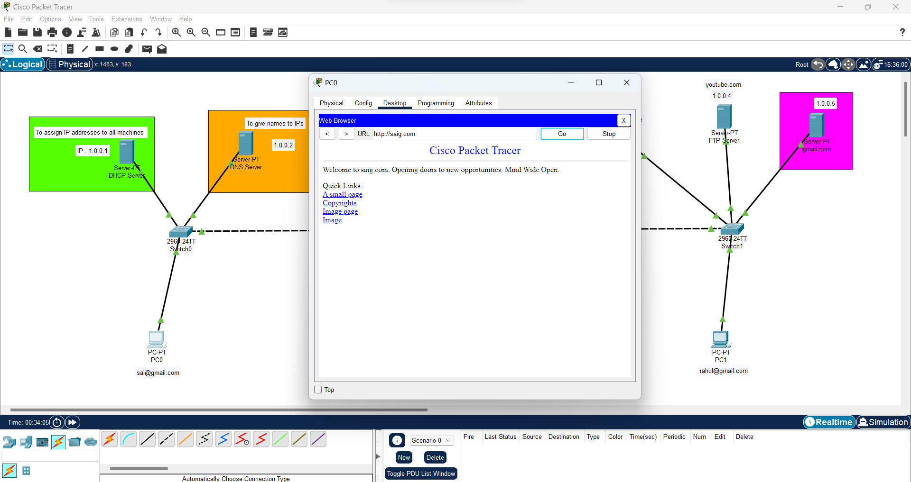
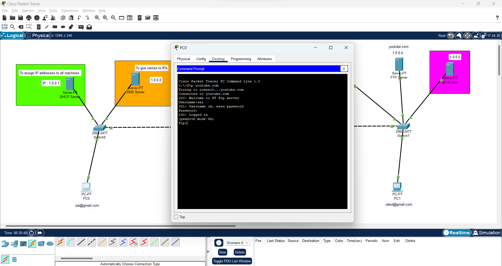
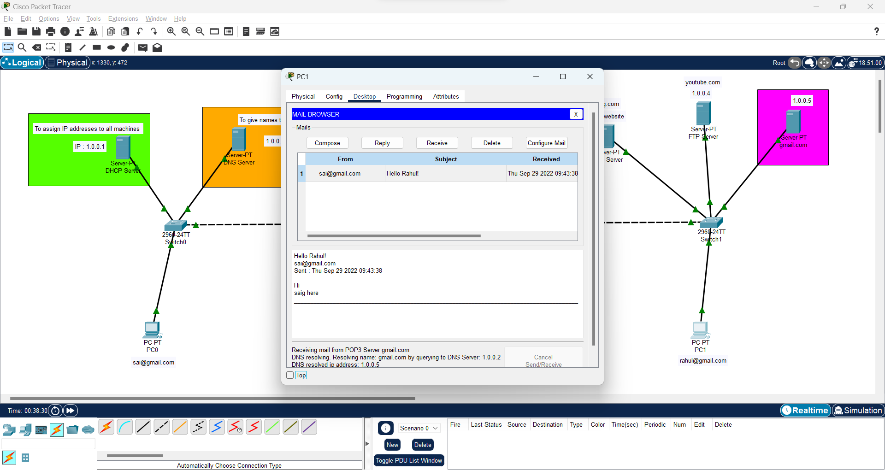

# Web_Based_Mailing_Services

## **Steps involved :**
  - Add two PCs, two Switches and five Servers(DHCP, DNS, Web Server, FTP Server, Mail Server). Connect them all physically using a wire and wait fot them to establish the connectivity.
  - Assign IPs to all the servers. Assign Gmail IDs to both the PCs.
  - Configure DHCP Server with its IP address and DNS Servers IP address. Turn the DHCP Service ON. The others will be assigned by themselves.
  - Configure DNS, Web, FTP, Gmail Servers and the PCs.
  - Add users in the Gmail Server.
  - Configure Mail at sender and receiver ends.
  - Enter into the Command Prompt of first PC and login to the FTP Server.
  - Now click the Email icon, provide the receivers details, compose a mail and Send it.
  - Now on the receivers end you'll find the mail in the received section.
  
  
## **Working :**

**Setup :**

**Web browser :**

**FTP Login :**

**Composing Mail :**

**Sent successfully :**

**Mail received at the other end :**

